# 🏠 House Price Prediction

<p align="center">
  
  
  
  
  
  
</p>

<p align="center">
  An end-to-end Machine Learning project for predicting residential property prices.
</p>

---

## 📑 Table of contents

- [Project overview](#-project-overview)
- [Project workflow](#-project-workflow)
- [Technologies and tools](#-technologies-and-tools)
- [Dataset](#-dataset)
- [Target transformation](#-target-transformation)
- [Exploratory data analysis](#-exploratory-data-analysis)
- [Data cleaning](#-data-cleaning)
- [Outlier analysis](#-outlier-analysis)
- [Feature Engineering](#-feature-engineering)
- [Models](#-models)
- [Cross-validation](#-cross-validation)
- [Hyperparameter tuning](#-hyperparameter-tuning)
- [Final model selection](#-final-model-selection)
- [Final results](#-final-results)
- [Error analysis](#-error-analysis)
- [Repository structure](#-repository-structure)
- [How to run the project](#-how-to-run-the-project)
- [Using the saved model](#-using-the-saved-model)
- [Conclusions](#-conclusions)

---

## 🎯 Project overview

The goal of this project is to predict the sale price of a residential property based on its characteristics.

This is a **supervised regression problem**.

The complete Machine Learning workflow includes:

- initial data inspection;
- baseline creation;
- target distribution analysis;
- exploratory data analysis;
- hypothesis testing;
- missing-value analysis;
- categorical-feature analysis;
- outlier analysis;
- semantic data cleaning;
- Feature Engineering;
- preprocessing pipelines;
- model comparison;
- cross-validation;
- hyperparameter tuning;
- ensemble testing;
- final holdout evaluation;
- residual and price-segment analysis;
- saving a production-ready model.

---

## 🧭 Project workflow

```mermaid
flowchart LR
    A[Raw data] --> B[Initial analysis]
    B --> C[Target transformation]
    C --> D[EDA and hypotheses]
    D --> E[Data cleaning]
    E --> F[Feature Engineering]
    F --> G[Model comparison]
    G --> H[Cross-validation]
    H --> I[Hyperparameter tuning]
    I --> J[Ensemble testing]
    J --> K[Final holdout]
    K --> L[Saved model]
```



---

## 🛠 Technologies and tools

<p align="center">
  <code></code>
  <code></code>
  <code></code>
  <code></code>
  <code></code>
  <code></code>
  <code></code>
</p>

The main libraries used in the project are:

- `pandas` — data loading and analysis;
- `numpy` — numerical operations;
- `matplotlib` and `seaborn` — visualizations;
- `scikit-learn` — preprocessing, models, metrics, cross-validation and tuning;
- `cloudpickle` — saving the complete trained pipeline.

---

## 📊 Dataset

The dataset contains:

- **1,460 houses;**
- **81 columns;**
- **79 predictors used for modeling;**
- `SalePrice` as the target;
- `Id` as a technical identifier.

The dataset includes both numerical and categorical features:

- property area;
- overall quality and condition;
- construction and renovation year;
- neighborhood;
- garage;
- basement;
- bathrooms;
- porch area;
- air conditioning;
- sale information;
- additional property characteristics.

The data does not contain:

- duplicate rows;
- duplicate `Id` values;
- missing target values.

---

## 📈 Target transformation

The original `SalePrice` distribution has a long right tail caused by a relatively small number of expensive houses.

The original target skewness was approximately:

```text
1.883
```

After applying:

```python
np.log1p(SalePrice)
```

the skewness decreased to approximately:

```text
0.121
```

The logarithmic transformation:

- makes the target distribution more symmetric;
- reduces the influence of very expensive houses;
- makes relative prediction errors more important;
- improves the stability of regression models.

The models are trained on to predict `log1p(SalePrice)`. Predictions are returned to the original price scale using:

```python
np.expm1(prediction)
```

---

## 🔎 Exploratory data analysis

Eight main hypotheses were analyzed.

### 1. Overall quality

Higher-quality houses should have higher prices.

The correlation between `OverallQual` and `SalePrice` was approximately:

```text
0.791
```

This was one of the strongest relationships in the dataset.

### 2. Living area

Larger living areas should be associated with higher prices.

The correlation between `GrLivArea` and `SalePrice` was approximately:

```text
0.709
```

### 3. Neighborhood

Property prices differed substantially between neighborhoods.

The most expensive neighborhoods included:

- `NridgHt`;
- `NoRidge`;
- `StoneBr`.

The least expensive included:

- `MeadowV`;
- `IDOTRR`;
- `BrDale`.

### 4. Construction year

Newer houses generally had higher prices.

The correlation between `YearBuilt` and `SalePrice` was approximately:

```text
0.523
```

### 5. Garage capacity

Houses with larger garages were generally more expensive.

The correlation between `GarageCars` and `SalePrice` was approximately:

```text
0.640
```

### 6. Basement area

Houses with larger basements generally had higher prices.

The correlation between `TotalBsmtSF` and `SalePrice` was approximately:

```text
0.614
```

### 7. Overall condition

The relationship between `OverallCond` and price was weaker than expected:

```text
-0.078
```

Overall condition is different from construction and finish quality. A house can be in acceptable condition but still have a lower-quality design or location.

### 8. Central air conditioning

Houses with central air conditioning had noticeably higher median prices.

> The plots and correlations show associations, but they do not prove direct causation.

---

## 🧹 Data cleaning

The missing values were divided into two types.

### Structural absence

In many columns, a missing value means that the house does not contain that object.

Examples:

- no garage;
- no basement;
- no fireplace;
- no pool;
- no fence;
- no alley access.

These categorical values were filled with:

```text
None
```

Related numerical values were filled with:

```text
0
```

### Ordinary missing values

Ordinary numerical missing values were filled with the median:

```python
SimpleImputer(strategy='median')
```

Ordinary categorical missing values were filled with the most frequent category:

```python
SimpleImputer(strategy='most_frequent')
```

### Categorical encoding

Categorical features were converted using:

```python
OneHotEncoder(handle_unknown='ignore')
```

Unknown categories in future data therefore do not cause an error.

### Numerical scaling

Numerical values were standardized using:

```python
StandardScaler()
```

All learned preprocessing operations were placed inside a `Pipeline` and fitted separately inside each cross-validation fold.

---

## ⚠️ Outlier analysis

Potential outliers were analyzed in:

- `GrLivArea`;
- `LotArea`;
- `TotalBsmtSF`;
- `GarageArea`;
- `1stFlrSF`;
- `YearBuilt`.

The IQR method identified unusual values, including several houses with more than `4,000` square feet of living area.

These observations were not automatically deleted because they may represent:

- real luxury houses;
- large properties;
- unusual buildings;
- rare but valid market cases.

The logarithmic target transformation reduces their influence without removing real observations.

---

## ⚙️ Feature Engineering

Fifteen candidate features were initially explored:

- `TotalSF`;
- `TotalBathrooms`;
- `TotalPorchSF`;
- `HouseAge`;
- `RemodelAge`;
- `GarageAge`;
- `IsRemodeled`;
- `HasGarage`;
- `HasBasement`;
- `HasFireplace`;
- `HasPool`;
- `Has2ndFloor`;
- `HasPorch`;
- `QualGrLivArea`;
- `QualTotalSF`.

The strongest new correlations included:

| Feature | Correlation with log price |
|---|---:|
| `QualTotalSF` | 0.855 |
| `QualGrLivArea` | 0.812 |
| `TotalSF` | 0.805 |
| `TotalBathrooms` | 0.677 |
| `HasFireplace` | 0.510 |
| `HouseAge` | −0.574 |
| `RemodelAge` | −0.571 |

However, high correlation does not guarantee better validation quality.

After cross-validation, a compact final set was selected:

| Feature | Description |
|---|---|
| `TotalSF` | Total basement, first-floor and second-floor area |
| `TotalBathrooms` | Full and half bathrooms, including basement bathrooms |
| `TotalPorchSF` | Combined area of all porch and deck types |

The compact set improved most models without adding unnecessary complexity.

---

## 🤖 Models

The following regression models were compared:

- Dummy Median;
- Linear Regression;
- Ridge;
- Lasso;
- ElasticNet;
- K-Nearest Neighbors;
- Decision Tree;
- Random Forest;
- Gradient Boosting;
- Support Vector Regressor;
- Voting Regressor;
- Stacking Regressor.

The Dummy Median model was used as a starting baseline.

Its RMSLE was approximately:

```text
0.39–0.40
```

All serious final candidates performed substantially better.

---

## 🔄 Cross-validation

The project used **5-fold K-Fold Cross-Validation**.

The development data was divided into five parts:

1. the model trained on four folds;
2. validation was performed on the remaining fold;
3. the process was repeated five times;
4. the final score was calculated as the average of all folds.

The final 30% holdout was not used for:

- hypothesis-based modeling decisions;
- Feature Engineering validation;
- model comparison;
- hyperparameter tuning;
- final-model selection.

### Main metrics

- **RMSLE** — main metric; lower is better;
- **MAE** — average absolute error in price units;
- **RMSE** — penalizes large price errors;
- **R²** — proportion of price variation explained by the model;
- **RMSLE gap** — difference between training and validation RMSLE.

---

## 🎛 Hyperparameter tuning

The following automated methods were used:

- `GridSearchCV` for Lasso;
- `GridSearchCV` for ElasticNet;
- `RandomizedSearchCV` for Gradient Boosting;
- `RandomizedSearchCV` for Random Forest.

### Tuning results

| Model | Default CV RMSLE | Tuned CV RMSLE | Change |
|---|---:|---:|---:|
| Lasso | 0.1292 | **0.1269** | −0.0023 |
| ElasticNet | 0.1279 | **0.1271** | −0.0008 |
| Gradient Boosting | 0.1328 | **0.1281** | −0.0046 |
| Random Forest | 0.1429 | **0.1392** | −0.0038 |

A negative RMSLE change indicates improvement.

Tuning also reduced the overfitting gap for:

- Gradient Boosting;
- Random Forest.

### Best Gradient Boosting parameters

```python
GradientBoostingRegressor(
    n_estimators=200,
    learning_rate=0.05,
    max_depth=3,
    min_samples_split=10,
    min_samples_leaf=8,
    subsample=0.75,
    max_features=0.5,
    random_state=0
)
```

---

## 🏆 Final model selection

The final candidates were compared using mean validation RMSLE, standard deviation, R² and the train–validation gap.

| Model | CV RMSLE | CV STD | Stability-adjusted RMSLE | CV R² |
|---|---:|---:|---:|---:|
| **Tuned Gradient Boosting** | 0.1281 | **0.0116** | **0.1397** | **0.8707** |
| Stacking Regressor | 0.1215 | 0.0189 | 0.1403 | 0.8535 |
| Voting Regressor | **0.1214** | 0.0198 | 0.1411 | 0.8516 |
| Tuned Lasso | 0.1269 | 0.0225 | 0.1494 | 0.8075 |
| Tuned ElasticNet | 0.1271 | 0.0223 | 0.1495 | 0.8087 |
| Tuned Random Forest | 0.1392 | 0.0127 | 0.1518 | 0.8645 |

Voting and Stacking produced slightly lower average RMSLE, but their variation between folds was higher.

The final model was selected using:

```text
mean CV RMSLE + CV standard deviation
```

This criterion balances prediction quality and stability.

The selected model was:

```text
Tuned Gradient Boosting Regressor
```

The model was selected before the final holdout was evaluated.

---

## 📊 Final results

The final model was evaluated once on the untouched holdout containing **438 houses**.

| Metric | Result |
|---|---:|
| Train RMSLE | 0.0831 |
| **Holdout RMSLE** | **0.1246** |
| Train–holdout gap | 0.0416 |
| **Holdout MAE** | **15,458.95** |
| Holdout RMSE | 29,230.57 |
| **Holdout R²** | **0.8741** |

### Interpretation

- The model explains approximately **87.4%** of price variation.
- Its average absolute prediction error is approximately **15.5 thousand price units**.
- The median absolute error is approximately **9,849**.
- The median percentage error is approximately **5.92%**.
- The model substantially outperforms the Dummy Median baseline.
- A moderate train–holdout gap remains, but the model generalizes well.

---

## 🔍 Error analysis

The final holdout predictions included:

- **195 overpredictions;**
- **243 underpredictions.**

The average signed error was approximately:

```text
−1,030
```

This means that the model had a small overall tendency to underestimate prices.

The largest errors were found mainly among:

- very large houses;
- luxury properties;
- houses with unusual combinations of area and price;
- rare neighborhoods;
- properties that differed substantially from typical training examples.

Expensive houses produced the largest absolute errors, although their relative percentage errors were often more moderate.

### Price-segment matrix

Predictions were divided into four price segments:

- Low;
- Lower-middle;
- Upper-middle;
- High.

The model predicted the correct price segment for approximately:

```text
80.59%
```

of the holdout houses.

---

## ⭐ Most important features

The most important Gradient Boosting features included:

| Feature | Importance |
|---|---:|
| `TotalSF` | 0.330 |
| `OverallQual` | 0.262 |
| `TotalBathrooms` | 0.058 |
| `GarageCars` | 0.045 |
| `GrLivArea` | 0.031 |
| `GarageYrBlt` | 0.027 |
| `CentralAir` | 0.020 |

The results show that total area, overall quality, bathroom capacity and garage characteristics are especially important for house-price prediction.

---

## 📁 Repository structure

```text
house-price-prediction/
├── HousePrice.ipynb
├── houseprice.csv
├── HousePrice_Final_Gradient_Boosting_Model.pkl
└── README.md
```

### Files

- `HousePrice.ipynb` — complete project from initial analysis to final model;
- `houseprice.csv` — source dataset;
- `HousePrice_Final_Gradient_Boosting_Model.pkl` — fitted production model;
- `README.md` — project description and results.

---

## 🚀 How to run the project

### 1. Clone the repository

```bash
git clone https://github.com/YOUR_USERNAME/house-price-prediction.git
cd house-price-prediction
```

Replace `YOUR_USERNAME` with your GitHub username.

### 2. Install the required libraries

```bash
pip install numpy pandas matplotlib seaborn scikit-learn cloudpickle jupyter
```

### 3. Start Jupyter Notebook

```bash
jupyter notebook
```

### 4. Open the notebook

Open:

```text
HousePrice.ipynb
```

Then select:

```text
Run All
```

The notebook will run the complete project and save the fitted final model.

---

## 💾 Using the saved model

The final trained pipeline is saved as:

```text
HousePrice_Final_Gradient_Boosting_Model.pkl
```

Example of loading the model:

```python
import cloudpickle
import numpy as np
import pandas as pd

with open('HousePrice_Final_Gradient_Boosting_Model.pkl', 'rb') as file:
    model_bundle = cloudpickle.load(file)

house = pd.read_csv('houseprice.csv').drop(
    columns=['SalePrice', 'Id']
).iloc[[0]]

prediction_log = model_bundle['model'].predict(house)
predicted_price = np.expm1(prediction_log)[0]

print('Predicted sale price:', round(predicted_price, 2))
```

The saved model automatically performs:

- semantic missing-value processing;
- Feature Engineering;
- numerical imputation;
- categorical imputation;
- one-hot encoding;
- numerical scaling;
- logarithmic price prediction.

---

## ✅ Conclusions

The project produced a complete and reproducible Machine Learning workflow for house-price prediction.

Main conclusions:

- the target distribution was successfully improved with logarithmic transformation;
- eight hypotheses about property prices were analyzed;
- structural missing values were separated from ordinary missing values;
- potential outliers were analyzed without automatically deleting valid houses;
- fifteen candidate engineered features were studied;
- three compact features were retained after cross-validation;
- ten regression algorithms and two ensembles were compared;
- automated hyperparameter tuning improved the strongest candidates;
- Gradient Boosting provided the best balance of quality and stability;
- the final model achieved **0.1246 RMSLE** and **0.8741 R²**;
- the median prediction error was approximately **5.92%**;
- the final pipeline was trained on all labeled data and saved for future predictions.

---

<p align="center">
  <b>Final model: Tuned Gradient Boosting Regressor</b>
</p>

<p align="center">
  RMSLE: <b>0.1246</b> • MAE: <b>15,458.95</b> • R²: <b>0.8741</b>
</p>
